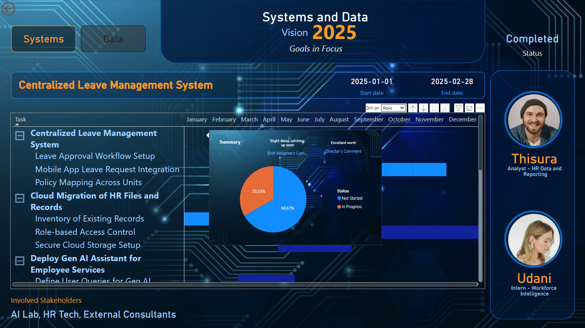

# 🎯 Goals Tracking Dashboard — HR Systems & Analytics

This repository contains a curated dataset and an interactive Power BI dashboard designed to track strategic goals, digital transformation initiatives, and operational tasks across HR Systems and Analytics teams. The dashboard provides a centralized view of progress, timelines, and stakeholder engagement, enabling data-driven decision-making and improved transparency across projects.

**📂 Contents**

- data
  - Tasks: List of key initiatives with timelines, team ownership, stakeholder mapping, and progress tracking.
  - SubTasks: Breakdown of sub-tasks linked to main goals or projects.
  - TeamMembers: Information about individuals involved, including roles and grades.
- dashboard
  - Power BI file (.pbix) showcasing visuals such as:
    - Goal progress timelines
    - Stakeholder involvement
    - Sub-task tracking with drill-through capabilities
  - Team-specific views and Gantt-style tracking

**🧩 Key Features**

- 📊 Progress Tracking: Visual status indicators for goals across Systems and Data teams.
- 👥 Stakeholder Map: Identify who is involved in each initiative.
- 🗂 Drill-Down Views: Explore sub-tasks tied to each key goal.
- ⏱ Timelines: Clearly see start and end dates with interactive visuals.
- 📈 Scalable: Built to accommodate future goals, KPIs, and analytics needs.

**🚀 Use Case**

This project is suitable for HR departments, project managers, or analytics teams seeking to track progress on ongoing system and people-related initiatives.

**🛠 Built With**

- Microsoft Power BI
- Excel datasets

**📌 Note**

This is a fictional but realistic representation of an HR project management dashboard designed for demonstration, academic, or professional portfolio use.

## Resources That Helped Me During the Project

- **YouTube: How to Power BI**  
  [https://youtube.com/@howtopowerbi?si=P7nhyHRHjPpQksLg](https://youtube.com/@howtopowerbi?si=P7nhyHRHjPpQksLg)

- **Dumbled Chart (YouTube)**  
  [https://youtube.com/@howtopowerbi?si=P7nhyHRHjPpQksLg](https://youtube.com/@howtopowerbi?si=P7nhyHRHjPpQksLg)

- **Health Chart (YouTube)**  
  [https://youtu.be/cYwioeHu_OU?si=oj10odqNqKEsDmZy](https://youtu.be/cYwioeHu_OU?si=oj10odqNqKEsDmZy)

- **Matrix Gantt Chart (YouTube)**  
  [https://youtu.be/QugkBqc-jIs?si=3AmXQT9BB_6MdZN2](https://youtu.be/QugkBqc-jIs?si=3AmXQT9BB_6MdZN2)

- **DataCamp Cheat Sheet: Formulas in DAX**  
  [https://media.datacamp.com/legacy/image/upload/v1653826988/Marketing/Blog/Formulas_in_DAX_Cheat_Sheet.pdf](https://media.datacamp.com/legacy/image/upload/v1653826988/Marketing/Blog/Formulas_in_DAX_Cheat_Sheet.pdf)

- **Profile Pic Generator**  
  [https://app.pfpmaker.com/](https://app.pfpmaker.com/)

- **AI Photo Generator (Photoleap - iOS App)**  
  [https://apps.apple.com/lk/app/photoleap-ai-art-photo-editor/id1191337894](https://apps.apple.com/lk/app/photoleap-ai-art-photo-editor/id1191337894)

- **Bulk Photo Resizer**  
  [https://imageresizer.com/bulk-resize](https://imageresizer.com/bulk-resize)

- **Photo Resizer**  
  [https://imageresizer.com/](https://imageresizer.com/)

- **Color Palette Generator (Coolors)**  
  [https://coolors.co/](https://coolors.co/)

- **Pics (PNGTree)**  
  [https://pngtree.com/](https://pngtree.com/)

- **Base64: How to embed Base64 images in Power BI**  
  [Power BI Point](https://powerbipoint.com/how-to-embedding-base64-images-in-power-bi/)
